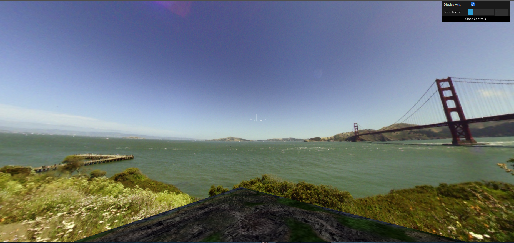
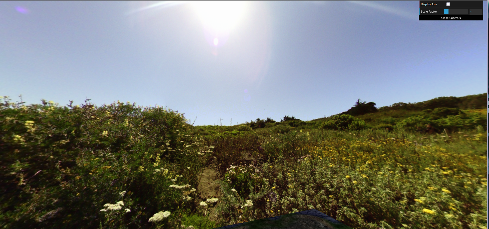

# CG 2023/2024

## Group T03G05
| Name             | Number    | E-Mail             |
| ---------------- | --------- | ------------------ |
| Miguel Pedrosa   | 202108809 | up202108809@edu.fe.up.pt              |
| Gonçalo Marques  | 202006874 | up202006874@edu.fe.up.pt              |
| Joana Marques    | 202103346 | up202103346@edu.fe.up.pt              |

|          Considerações Importantes        |
|------------------|
|Todas as funcionalidades foram implementadas|
|Implementamos a funcionalidade 'A' dos desenvolvimentos adicionais, realizando a abelha uma trajetória em parábola da quando desce ou sobe de uma flor, assim como quando se dirige à colmeia.|
|Embora não fosse obrigatório, fizemos também os shaders e texturas para a funcionalidade 'B' dos desenvolvimentos adicionais|

|         Funcionalidades/detalhes extra      |
|------------------|
|As flores são altamente parametrizáveis (para além do que é pedido no enunciado).|
|Existe uma grande quantidade de combinações possíveis para os materiais das petalas das flores. Cada flor pode ter pétalas com uma de duas texturas diferentes, de cor variavel e randomizada.|
|Os recetáculos das flores foram otimizados, para permitir a geração de uma grande quantidade de flores na cena, sem aumentar significativamente o numero de vértices e faces. Cada recétaculo tem o formato de um cone. Para simular o efeito de curvatura semelhante ao de uma esfera, fizemos uma textura com gradiente, sendo a imagem gradualmente mais escura nas bordas, e mais clara no centro.|
|As folhas nos caules das flores nascem com tamanhos diferentes e ângulos de rotação e inserção diferentes nas junções dos segmentos de caule. (Ou seja, as folhas nao nascem todas do mesmo "lado" do caule).|
|As flores têm duas camadas de pétalas que nascem em ângulos diferentes, o que aumenta o realismo e melhora a beleza da cena.|
|É possível fazer "lock" da câmara com a abelha, carregando na tecla Y, sendo assim possível acompanhar todo o seu movimento, tal como num videojogo.|
|Nos shaders da relva, alteramos também a iluminação, ficando a raíz de cada folha de relva menos iluminada, e a ponta melhor iluminada. Isto permitiu fazer um melhor "blend" das folhas de relva (objetos físicos) com o terreno e a sua textura, dando assim um efeito mais realista e tornando a cena mais agradável ao olhar.|
|É possível armazenar até 40 grãos de pólen na colmeia. Depois de pousar um grão na colmeia, o grão fica visível, no seu espaco adequado. Os seguintes grãos são colocados lado a lado, de forma matricial.|

|                  |                  |                  |
|------------------|------------------|------------------|
|  |  |  |
|  |  |   |
|  |  |   |
