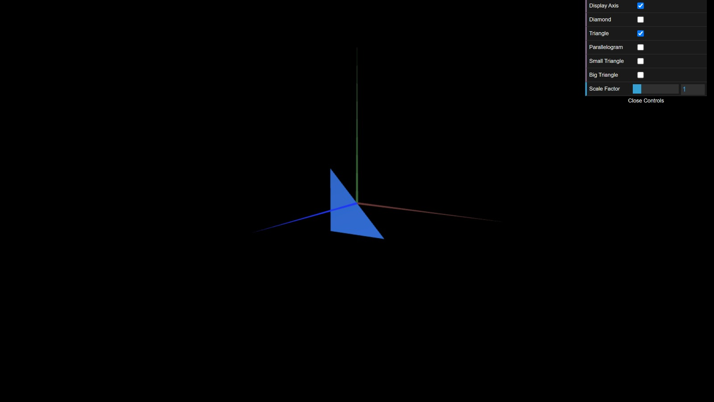
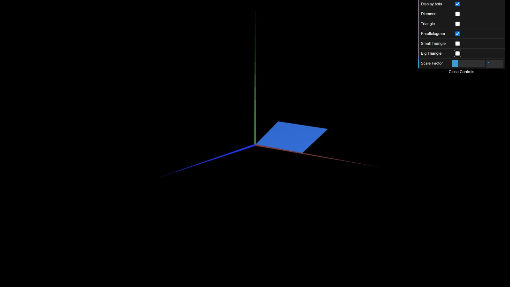
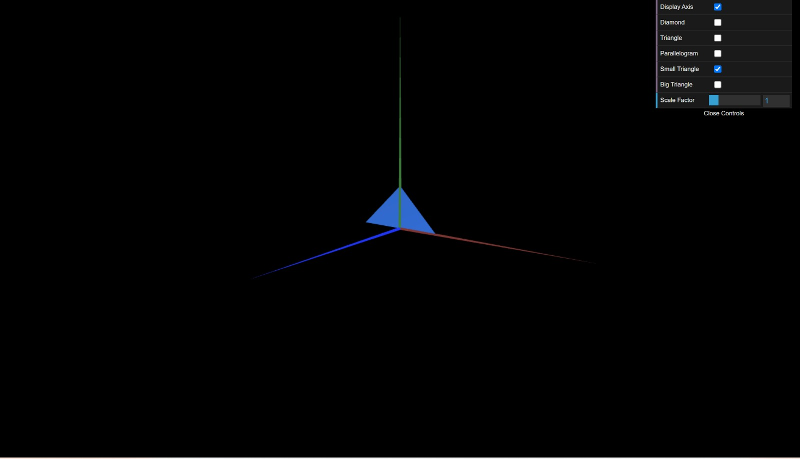

# CG 2023/2024

## Group T0xG0y

## TP 1 Notes

(add your main observations/remarks about your experiments here, in a bulleted list, and remove this line. Some examples below)

- diamond

- triangle 1.1

- parallelogram

- small triangle

- big triangle

- final result

