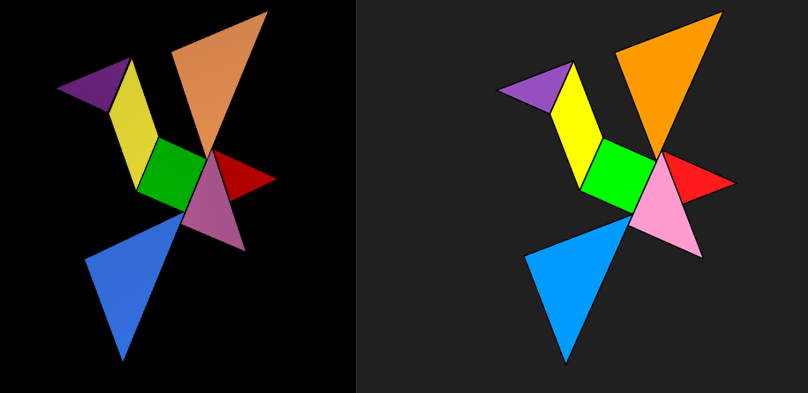

# CG 2023/2024

## Group T03G05

## TP 2 Notes

### Exercise 1

Exercise 1 involved creating a Tangram figure by applying geometric transformations to individual geometric shapes. 

The first step was to create an instance of the MyDiamond class and position it on the XY plane using matrix multiplication operations. This involved declaring transformation matrices and using the multMatrix() function to apply the transformations.

Using the geometric transformation methods provided by the WebCGF library, the remaining Tangram pieces were placed in the scene. These transformations were applied relative to the origin, with the help of pushMatrix() and popMatrix() functions to manage the transformation state.

A new class, MyTangram, was created as a subclass of CGFobject to serve as a composite object encompassing all the individual Tangram pieces. The display() method of MyTangram was implemented to organize and display the entire Tangram figure.

In the MyScene class, an instance of MyTangram was created in the init() method, and the display() method was updated to invoke the display() method of the MyTangram object. This ensures that the entire Tangram figure is rendered correctly within the scene.

*Figure 1. Final Result of Tangram figure after applying geometric transformations*

