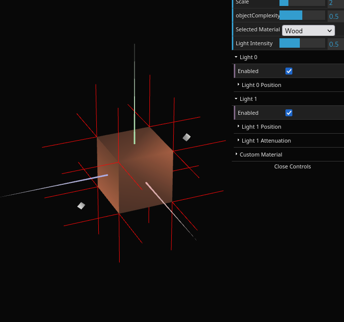
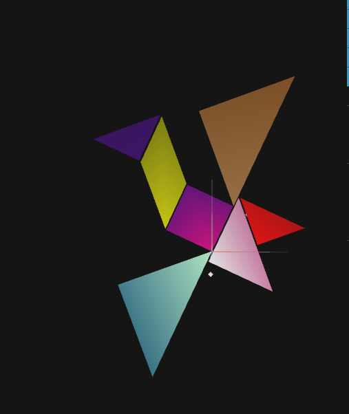
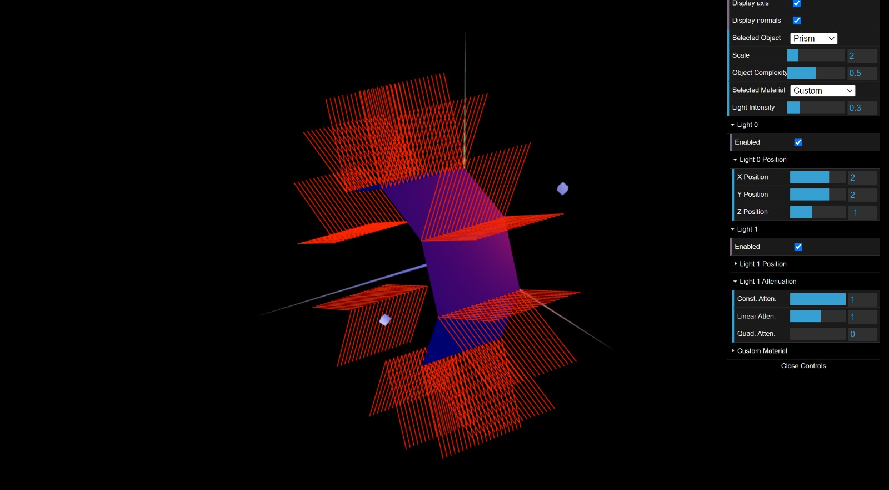
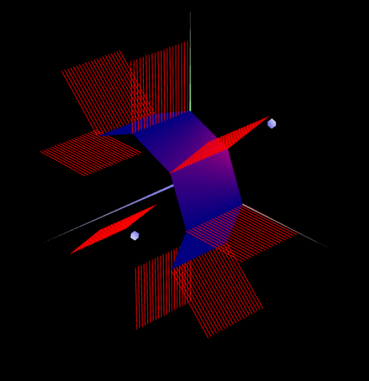

# CG 2023/2024

## Group T03G05

## TP 3 Notes

| **Exercise 1**|
| :-----------: |
|  |
|  |

| **Exercise 2**|
| :-----------: |
|  |

To answer the question posed in part 2: "Comente a eventualidade de, com esta definição de normais, a iluminação calculada ser semelhante à calculada com Constant Shading":

In Constant Shading, each polygon of a 3D model is filled with a single shade of color, which is determined by the angle between the light source and the polygon's surface normal. Since all vertices of a face in this model use the same normal, they will all reflect light equally, resulting in a flat, consistent color across the face, just like Constant Shading.

This approach is different from other shading techniques like Gouraud or Phong shading, where the normals at vertices would be interpolated across the surface of the polygon, resulting in a gradient of color and a more realistic rendering of light and shadow.

| **Exercise 3**|
| :-----------: |
|  |