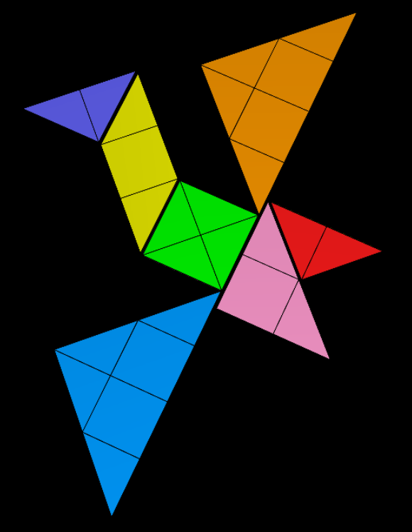
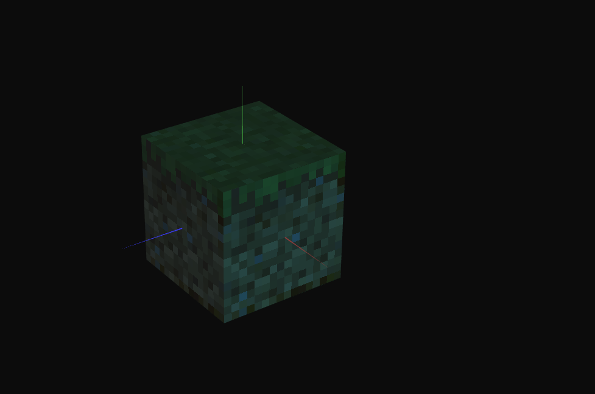

# CG 2023/2024

## Group T03G05

## TP 4 Notes

**Exercise 1**|

In this exercise, we had to map each piece of the Tangram to its corresponding section in the tangram.png file. We proceeded in assigning the "tangram.png" texture to each vertex within each polygon of the figure. The primary challenge was to determine the appropriate texture coordinates for each polygon and grasping the orientation of the axes within it.

| **Exercise 2**|
| :-----------: |
|  |