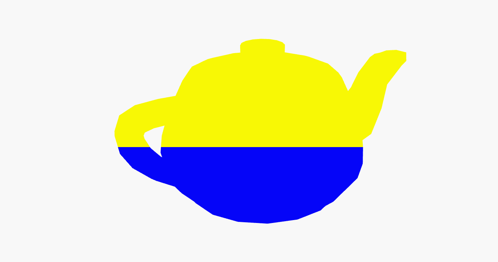
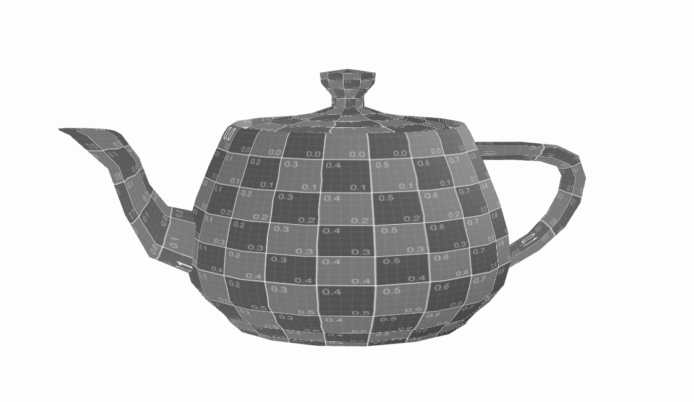

# CG 2023/2024

## Group T03G05

## TP 5 Notes

For TP5, fundamental concepts of shaders were applied and extended to create visual effects on objects within a scene.

**Exercise 1**|

Exercise 1 focused on applying custom vertex and fragment shaders to color a teapot based on its position and to create a back-and-forth translation effect on the X-axis. The first part involved creating shaders to color the teapot yellow in the upper half of the screen and blue in the lower half. This was achieved by passing vertex position data from the vertex shader to the fragment shader and using it to determine the color output. The second part involved modifying the animation shader to create a translation effect using a sine wave, with the translation depending on the scaleFactor parameter from the interface.

**Exercise 2**

Exercise 2 extended the shader application to a plane, aiming to create a water effect. Two new shaders were created and applied to the plane, replacing the in-scene textures with water textures. The vertex shader was modified to use the waterMap.jpg as a heightmap, shifting vertices according to the color components of the texture. Additionally, animation was introduced to the plane using the shaders, varying the association of texture coordinates to vertices and fragments over time to create a dynamic water effect.

